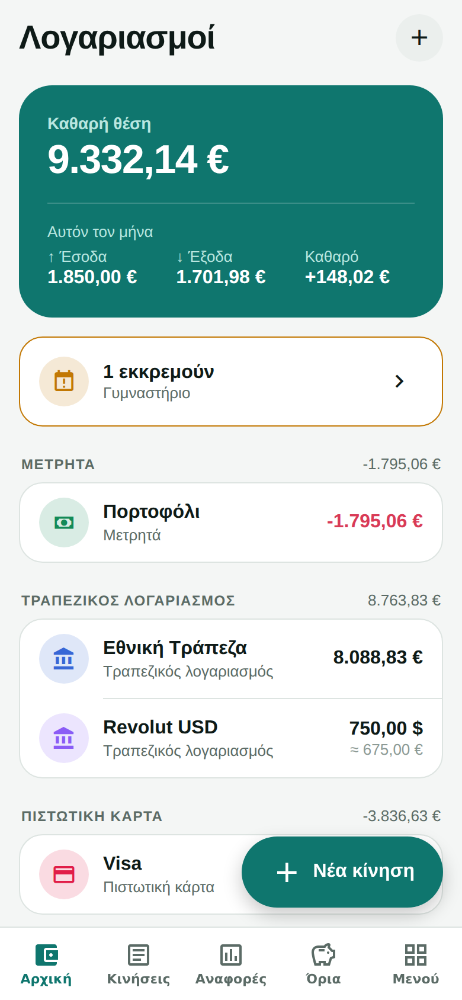
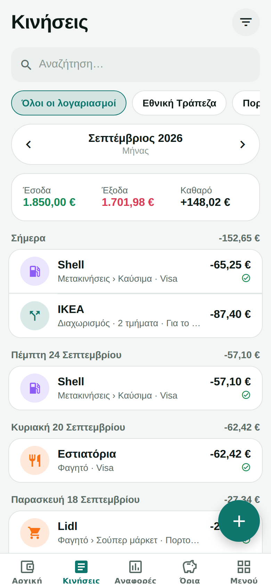
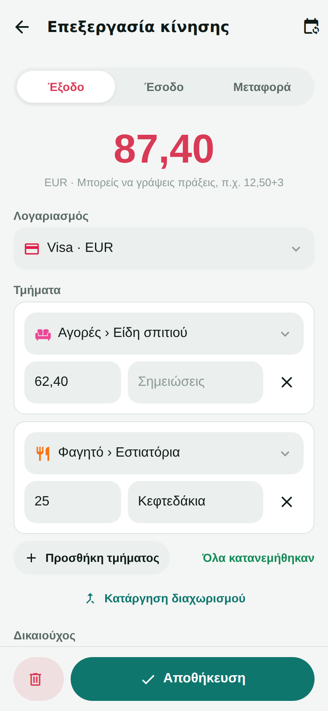
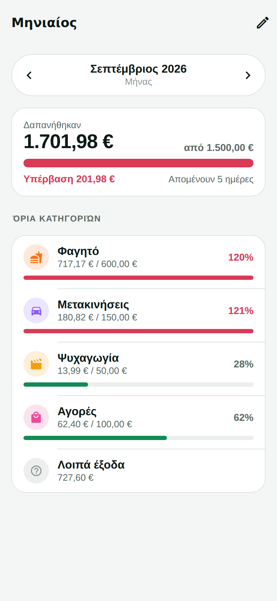
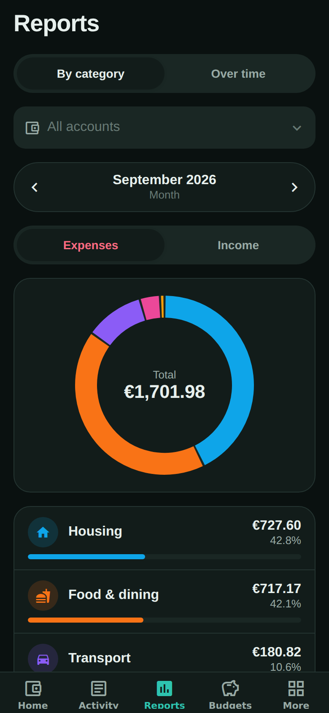
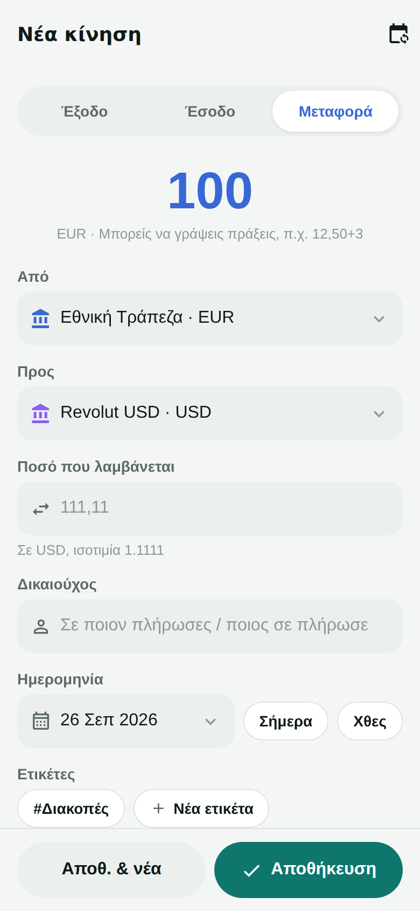

<!-- Made for LPHL - lphl.nekten.eu - by Nekten - lphl@nekten.eu - -->


# LPHL FASOULI

A private, full-featured personal finance app for Android, Linux (Arch Linux and an AppImage), SailfishOS, iOS and
the web, built with Expo (SDK 57) and React Native. Every feature is free. Data lives on the device in SQLite and syncs
between your devices through your own cloud storage; an online version on your own Nextcloud server reaches it from
any browser.

LPHL FASOULI (formerly LPHL CHRIMA, and before that Money Dance) keeps all your money in one place: accounts in any
currency, including cryptocurrencies and gold; income and expenses with categories, payees and tags; transfers and
split transactions; scheduled payments; budgets and reports; receipt photos and scanning; and a book for each year. It
has its own design and works in Greek and English.

Renamed from LPHL CHRIMA: updates install over it and keep everything. The name shown and the download files
(`lphl-fasouli-…`) changed; the packages inside them (Android, pacman, RPM), the data files, the sync folder
(`LPHLChrima`), the releases repository and the online version's path (`/lphl-chrima`) keep the old name, so
installed apps, their data and sync carry on.

## Download

Every push to `main` builds the app for Android, Linux and SailfishOS on GitHub Actions and publishes it here:

**https://github.com/azzinder/LPHL-FASOULI/releases/tag/lphl-chrima**

Each build is numbered `1.0.<build>` and dated. The release page shows its version, date and the commit it was built
from; the app shows its version and date at the bottom of **More**, so you can tell whether a device has the latest.

The same files are also published to the public **https://github.com/azzinder/lphl-chrima-releases/releases**
(the five newest versions), where the apps look for new versions themselves: see **Updates** under Features.

1. Open that link on your Android phone (sign in to GitHub if the repository is private).
2. Tap **lphl-fasouli.apk** to download it.
3. Open the downloaded file. Android asks once to allow installing apps from your browser or file manager; allow it.
4. Tap **Install**. Newer builds install over the old one and keep your data.

**Arch Linux** (x86_64): download `lphl-fasouli-x86_64.pacman` and install it with
`sudo pacman -U lphl-fasouli-x86_64.pacman`. It appears as LPHL FASOULI in the applications menu.

**Other Linux** (x86_64): `lphl-fasouli-x86_64.AppImage` runs without installing: make it executable
(`chmod +x`) and start it. It needs FUSE 2 (`fuse2` on Arch).

**SailfishOS** 4.6 or newer: install `lphl-fasouli-sailfish-aarch64.rpm` (current phones) or
`lphl-fasouli-sailfish-armv7hl.rpm` (older 32-bit ones), e.g. from the file manager, with "Allow untrusted software"
on in Settings.

The Linux and SailfishOS versions have everything except receipt photos and scanning and the home-screen widget.
Their data stays on the computer or phone, in the app's own storage, and syncs with the other devices as usual.

**Online**, from any browser: `lphl-fasouli-web.zip` goes on your own Nextcloud server; see
[Online version](#online-version-on-your-nextcloud-server).

Coming from Money Dance: LPHL FASOULI installs as a separate app. In Money Dance, open **More → Backup & data →
Back up** and save the file; in LPHL FASOULI use **Restore backup** with that file, then uninstall Money Dance.
To sync again, connect each device to a new, empty WebDAV folder (the sync folder is now `LPHLChrima/`).

The build history is under **Actions → Build**. Its jobs hand their files to the publishing job through a draft release (`build-<number>`, deleted once published), not artifacts, so builds do not fill the account's Actions storage; the build also deletes artifacts older builds left.

<p>
  
  
  
  
  
  
</p>

## Features

**Accounts**
- Cash, bank, credit card, savings, investment, cryptocurrency, work, asset and loan/liability accounts
- Each account has its own currency, opening balance and color
- Accounts can be excluded from totals or archived
- The home screen groups accounts by type. **Account order** (below the accounts, or long-press an account) moves
  whole groups and the accounts within each group; the order syncs between devices
- Net worth across all accounts, converted to your main currency
- **Hide amounts**: the eye next to the net worth (or an account's balance) turns every amount into blurred dots, on
  every screen and the widget, until tapped again; what you type in, and PDF reports, still show in full
- Accounts in another currency (e.g. a bitcoin wallet) also show their value in the main currency and the rate used;
  their transactions in a cryptocurrency show it too
- Cleared and reconciled balances, with one-tap reconciliation

**Books**
- Transactions and balances are kept in books, e.g. one book per year. Everything recorded before books came in is in
  one book named after the year (e.g. 2026)
- **More → Books → New book** opens the next one (the name suggests the next year). For each account choose whether it
  continues, and whether it keeps its balance from the previous book or starts from zero (work and income accounts
  start from zero by default)
- The book button at the top of Home, Activity and Reports switches books, or shows **All books** together (every
  account, across all books). The home-screen widget follows the book shown
- New transactions go into the book shown; the **Book** field on a transaction moves it (with its transfer or split
  parts) to another book later. An account's books and how it starts in each are in its settings
- Categories, payees, tags, currencies, plans and budgets are shared by all books; budgets follow dates, not books
- Books sync between devices and are included in backups

**Transactions**
- Expenses, income and transfers between accounts, including transfers between currencies with the received amount and rate
- Split transactions: one payment across several categories, with a live "remaining" check
- Payees with suggestions; picking a known payee fills in its last category
- Tags, reference or cheque numbers, notes, and statuses (not cleared, cleared, reconciled, void). Lists show each
  transaction's tags as labels in the tag's color next to the payee.
- The amount field is a calculator: type `12,50+3*2`. Both `,` and `.` work as the decimal separator.
- Duplicate, quick status toggle and delete from a long-press menu
- Search that ignores accents (e.g. `ΚΑΦΕΣ` finds `καφές`), in notes, payee, category, tags, account, reference /
  cheque number and amounts: `45` finds 45.00 to 45.99, `45,50` exactly 45.50 (split parts too)
- Filters by account, type, category (including subcategories and split parts), payee, tag, status, reference /
  cheque number, amount from–to (without sign, in each transaction's currency) and "with attachments"
- Exclude filters: leave out transactions with some tags (e.g. all but `#UNPAID`), categories (with their
  subcategories and split parts) or payees
- Periods by day, week, month, quarter, year or all time, with income, expense and net totals

**Receipts and attachments (Android)**
- Attach receipt photos (camera or gallery) and any other file (PDF, invoice, …) to a transaction.
  Photos are kept at up to 1800 px; tap one to see it full width, or share it.
- Receipt scanning: photograph a receipt and the app fills in the total, the date and the store, in Greek or
  English. The text is read on the phone (Tesseract OCR); the photo is never uploaded for this.
- Attachments sync between devices, encrypted like the rest of the data, and are included in backups.

**Categories, payees, tags**
- Category tree with two levels of subcategories (e.g. Food › Restaurants › Sushi), icons and colors, and a Greek or English default set
- Create, edit, merge and delete categories; rename, merge and delete payees; manage tags

**Plans and templates**
- Templates for frequent entries
- Recurring plans (daily, weekly, monthly or yearly, every N periods, optional end date)
- Plans are recorded automatically, or wait for you to apply or skip each one
- Due plans are shown on the home screen
- Reminders (Android): a notification on the day a plan falls due, or 1 or 3 days before, at the hour you choose,
  and for manual plans still waiting to be recorded; tapping it opens the plans. Turn them on in **Settings**.
  While the password lock is on they show no names or amounts

**Budgets**
- Weekly, monthly, quarterly or yearly budgets, for all accounts or one account, in any currency
- An overall limit plus per-category limits, with progress, overspending and "other spending" lines
- Browse earlier periods

**Reports**
- PDF report of a month, quarter, year or everything (in the book shown, for all accounts or one): totals, expenses
  and income by category, month by month, and optionally every transaction. On Android share it as PDF or print it;
  on Linux the print dialog prints it or saves it as PDF; on SailfishOS it is saved as a page to print elsewhere.
  Open it from the PDF button on Reports, or from an account's menu
- Spending or income by category as a ring chart and ranked list, with drill-down through both levels of subcategories
- Income vs expenses per month or year, with averages and savings rate

**Currencies**
- 57 currencies with correct minor units (JPY 0 digits, BTC 8 digits, …), including gold in troy ounces (XAU),
  British gold sovereigns (XGS, valued by the 7.32 g of gold they contain) and the cryptocurrencies BTC, ETH, SOL,
  XRP, USDT and USDC
- Manual exchange rates, or online updates: currencies from European Central Bank data, gold and cryptocurrencies
  (which the ECB does not publish) from market prices
- A new account in a currency without a rate gets it online right away; without one, the app says so instead of
  guessing. (The online version gets its rates from the phone through sync instead.)

**Data**
- Full JSON backup and restore
- Export to CSV (for spreadsheets, UTF-8 with BOM so Excel shows Greek correctly) and QIF (for other finance apps), for all accounts or a single one
- CSV import from banks or other apps: guesses Greek and English column names, supports separate debit/credit columns and several date formats
- Import a full backup from another Android finance app (`.zip`, or encrypted `.enc` with its password) under
  **More → Backup & data**. Accounts, categories, payees, tags, transfers, splits and archived transactions come
  across and are added to what is already there. The file is opened on the phone; nothing is uploaded.

**Sync between devices**
- Keeps phones and tablets in step, including a partner's phone, through a folder in your own cloud storage.
  Any WebDAV service works: Nextcloud, Koofr, pCloud, a NAS. There is no LPHL FASOULI server.
- With Nextcloud: type its address and choose **Sign in with Nextcloud**. Its sign-in opens in the browser (through
  Authentik or whatever else Nextcloud signs in with); choose **Grant access** and come back. The app gets an app
  password of its own and looks for the folder your other devices sync with anywhere in your Nextcloud (e.g.
  `Documents/LPHL-FASOULI/2026`); if it finds several you choose one, and you can always type another. It withdraws
  that password when you stop syncing on the device (and if you leave the setup before connecting). Other services,
  or a typed username and app password, work as before.
- If the server stops accepting a device's password ("Wrong username or password", e.g. its app password was removed
  in Nextcloud), **Sign in again** on the sync screen gives it new sign-in details, with Nextcloud or typed in. They
  must reach the same folder (checked with the device's encryption key); the folder, the encryption and the data stay.
- When sync fails (a rejected password, a missing folder, or no connection for more than a day), the home screen,
  the transactions and every account say so, and open the sync screen to put it right.
- Syncs automatically when the app opens, right after each change, and when the app goes to the background, or on demand
- Only changes are sent. If the same item was edited on two devices, the most recent edit wins.
  Items deleted on one device and used on another are cleaned up safely.
- A new device can take the cloud copy, or merge its own data. Default categories, payees and tags with the
  same name become one item, even across Greek and English.
- End-to-end encrypted: everything is encrypted on the phone (AES-256-GCM) before it is uploaded, with an
  encryption password you choose when you first connect. Other devices need that password to join; the cloud
  service only ever sees encrypted files. The password is not stored anywhere else, so it cannot be recovered.
- Receipt photos and other attachments travel the same way, encrypted.
- The login and the encryption key are kept in the phone's secure storage. Data travels over HTTPS.
- The same data from any browser, through the [online version](#online-version-on-your-nextcloud-server) on your own
  Nextcloud server.

**Home-screen widget (Android)**
- Net worth, this month's income and expenses (hidden while amounts are hidden in the app), and quick **− Expense** /
  **+ Income** buttons that open the form
- Drawn natively with plain Android views; updates right after changes in the app

**App**
- Greek and English (follows the device language by default)
- Two styles: Classic (teal, rounded) and Modernist (red accent, square, Archivo type; Greek text uses
  Inter Tight because Archivo has no Greek letters). Each in light, dark or system theme.
- Colors: the style's own colors or one of 12 LPHL palettes (LPHL House, Thermaikos, Vardaris, Garden,
  Terracotta, Oil lamp, Vesper, Modernist, Peach, Pistachio, Sky blue, Lilac), each with a light and dark version.
  The lock screen and the home-screen widget follow the chosen colors.
- Text on colored areas (the net-worth card, main buttons): white, as in the palette, or a color of your own
- The week can start on Monday or Sunday
- App lock with Face ID, fingerprint or the device PIN, or with a password
- The data on the device is encrypted; with the password lock on, it cannot be read without the password
- A second password: typing it opens a separate, empty space instead of your data. Nobody can tell whether one is
  set: every space shows the same lock settings (they never say whether a second password is set), a second password
  set inside the second space opens yet another space, the stored lock settings look the same either way, and
  unlocking takes the same time whichever password is typed. The second space never syncs with or reveals the first:
  it stays on the device unless you set up sync inside it, and then it cannot use the folder another space on the
  device syncs with (the app says so only after that folder's encryption password was typed correctly, so it tells
  nothing to someone without it). For full deniability keep it unsynced: another sync folder is visible, though
  unreadable, to whoever can open the Nextcloud account.
  If the lock is turned off inside the second space, that space opens directly and your data stays locked: to get
  back to it, choose **Password** there and type your real password as the new one.
  While the password lock is on, the widget hides amounts.
- Guided first-run setup, including "I already use LPHL FASOULI on another device"
- At start, after the logo: **Fasouli** and its saying ("Φασούλι το φασούλι γεμίζει το σακούλι" / "Bean by bean, the
  sack fills up.") on your chosen color, for about two seconds

**Updates**
- The app looks for a new version shortly after it opens and when it comes back, at most twice a day (switch it off,
  or check now, in **Settings**)
- When there is one, it first backs up the data on the device, then offers it: Android downloads it (the size is
  shown, with progress and Cancel) and opens the installer, which installs it over the current version and keeps the
  data (the first time Android asks to allow installing apps from LPHL FASOULI); the Linux versions open the download
  page
- The automatic backups are encrypted with the key of the space they come from (as unreadable as the database without
  the password, and nothing in them tells the spaces apart); **Backup & data → Automatic backups** lists this space's
  and restores one. The six newest are kept. The online version is updated on its server instead

## Online version (on your Nextcloud server)

For when your phone is not at hand: open `https://your-site/lphl-chrima/` in any browser, sign in with Authentik, then
type the sync encryption password. The page is bright orange (#FF6200, the Dutch national team's) unless you pick
other colors in Settings for the session. Your data appears as on the phone, and every change goes back to the server
right away, so the phone has it at its next sync.

- **Sign in with Authentik** opens Nextcloud's own sign-in in a new window (Nextcloud's Login Flow v2): sign in with
  Authentik, then **Grant access**. The page finds the folder your devices
  sync with (or lets you choose or type it), gets an app password of its own and withdraws it when you sign out, are
  signed out after 15 minutes, or close the page (sent as the page starts closing, which Firefox needs). Nextcloud
  names it after the browser; one left behind by a browser that shut down first can be removed under **Settings →
  Security → Devices & sessions**. The Nextcloud window is cut off from the page, and the flow must stay on the same
  site.
- Or sign in with your Nextcloud username and an app password, which stays yours.

- It works with the data your phone already syncs to that Nextcloud (**More → Sync between devices**, address
  `https://your-site/remote.php/dav/files/USERNAME`, or `https://your-site/nextcloud/remote.php/…` when Nextcloud is
  under a path). The sign-in page fills that address in (see `config.json` below).
- Nothing is kept in the browser: the data is downloaded into the page's memory, and the login and keys live only
  there. **More → Sign out** (or closing or reloading the page) leaves nothing behind. After 15 minutes without use it
  signs out by itself, first hiding the data and uploading anything still waiting; the browser asks before the page is
  closed with changes not yet uploaded.
- Decryption happens in the browser: the server still only stores and sends encrypted files. Use a Nextcloud app
  password (**Settings → Security → Devices & sessions**), which you can revoke at any time.
- The page talks only to its own site: exchange rates arrive from the phone through sync (or are typed in), never from
  the rate services.
- Not there: receipt photos, reminders, the widget, updates and the password lock (there is nothing stored to lock).
  Each browser session that changes something appears to the other devices as one more device (a small folder under
  `LPHLChrima/devices/`).

### Installing it on the server

`lphl-fasouli-web.zip` (in every release) holds the folder `lphl-chrima/`, `SHA256SUMS` (every file's SHA-256, also in
the release as `lphl-fasouli-web.SHA256SUMS`) and two example configurations. The page must be served at `/lphl-chrima/`
on the **same site** as Nextcloud (browsers only let a page use the WebDAV of its own site). Install it once, and again
for each new version:

- **Apache, a web root with `AllowOverride All`** (e.g. `/srv/http`): copy `lphl-chrima/` there, keeping its hidden
  `.htaccess`, which does the rest (every address inside the app answers with its page; Nextcloud's own rewrite rules
  are switched off for the folder). Nothing else to configure.
- **Apache, the folder elsewhere** (e.g. `/var/www/lphl-chrima`): add the lines of `apache.conf` (an `Alias`) to the
  site's `<VirtualHost>`.
- **nginx**: add the `location` block of `nginx.conf` to the site's `server { }`, before its other `location`s.

Avoid copying it into Nextcloud's own folder: Nextcloud's integrity check reports it as an extra file and its updates
may remove it. If Nextcloud runs in Docker, add the same `location` or `Alias` to the web server or proxy in front of it.

**Nextcloud under a path.** If Nextcloud is not at the root of the site (e.g. `https://your-site/nextcloud/`), put a
`config.json` next to `index.html`:

```json
{ "nextcloud": "/nextcloud" }
```

It is read once when the page opens (with the site's cookies, so it also works behind a sign-in gate such as
Authentik's forward auth on `/lphl-chrima/`); only a path on the same site is accepted, and without the file Nextcloud
is taken to be at the root. It is the only file the server should add to the folder. Nextcloud's own paths
(`/remote.php`, `/index.php/login/v2`, `/login/v2/…`, `/ocs/…`) must stay outside any such gate.

**Content-Security-Policy.** The page loads nothing from other sites and has been checked, with no violations, under:

```
default-src 'self'; script-src 'self' 'wasm-unsafe-eval'; style-src 'self' 'unsafe-inline'; img-src 'self';
font-src 'self'; connect-src 'self'; object-src 'none'; base-uri 'self'; frame-ancestors 'self'
```

`'wasm-unsafe-eval'` (or the broader `'unsafe-eval'`) lets the database (SQLite in WebAssembly) start; `style-src`
needs `'unsafe-inline'` because the interface sets its styles from script (React Native Web), and without it the
layout falls apart.

**Keep watching the folder.** A changed file in `lphl-chrima/` would see every user's Nextcloud password and
encryption password as they are typed. Check it against the release with
`cd /srv/http && sha256sum --quiet -c lphl-fasouli-web.SHA256SUMS` (any output means a changed or missing file), and
treat any file not in the list, other than `config.json`, as foreign.

## Run it

```bash
npm install
npx expo start
```

Then open the app on your phone with **Expo Go** (scan the QR code), or press `a` for an Android emulator, `i` for the iOS simulator or `w` for the browser.
The home-screen widget needs a real build (the APK above, or `npx expo run:android`), not Expo Go.

To build the APK yourself, as the GitHub workflow does (needs JDK 17 and the Android SDK):

```bash
npx expo prebuild --platform android
cd android && ./gradlew assembleRelease   # → android/app/build/outputs/apk/release/app-release.apk
```

For Play Store or App Store builds, use EAS: `npx eas-cli@latest build`.

### Linux versions

Both run the web build inside a small shell, with `EXPO_PUBLIC_SHELL` telling the app which one (see
`src/lib/shell.ts`). The database is SQLite in WebAssembly ([sql.js](https://github.com/sql-js/sql.js)), kept in the
page's IndexedDB.

```bash
# Desktop (Arch Linux package and AppImage), with Electron
EXPO_PUBLIC_SHELL=electron npx expo export --platform web --output-dir desktop/web
cp node_modules/sql.js/dist/sql-wasm-browser.* desktop/web/
cd desktop && npm ci && npx electron-builder --linux pacman AppImage --x64   # → desktop/dist/

# SailfishOS (RPM), with the Sailfish SDK (or its Docker image, as the GitHub workflow does)
EXPO_PUBLIC_SHELL=sailfish npx expo export --platform web --output-dir sailfish/web
cp node_modules/sql.js/dist/sql-wasm-browser.* sailfish/web/
cd sailfish && mb2 -t SailfishOS-4.6.0.13-aarch64 build                     # → sailfish/RPMS/
```

### Online version

The web build with `EXPO_PUBLIC_SHELL=web`, served under `/lphl-chrima` (`LPHL_WEB_BASE`, see `app.config.ts`).
`src/lib/online.ts` keeps its database (sql.js) and secrets in memory only and reads the optional `config.json`;
`online/` has the server configuration. The build also writes `SHA256SUMS` for the folder.

```bash
LPHL_WEB_BASE=/lphl-chrima EXPO_PUBLIC_SHELL=web npx expo export --platform web --output-dir online-build/lphl-chrima
cp node_modules/sql.js/dist/sql-wasm-browser.* online/.htaccess online-build/lphl-chrima/
```

## Develop

```bash
npm test            # unit tests: money, dates, recurrence, CSV, receipts, every repository, sync between two devices
                    # (with attachments), and the Linux versions' database
npm run typecheck   # TypeScript
npm run lint        # ESLint (expo lint)
```

The repository tests run on Node's built-in SQLite (`node:sqlite`), so they need Node 22.13 or newer.

### Structure

```
src/
  app/            screens (Expo Router: every file is a route)
    (tabs)/       Accounts, Transactions, Reports, Budgets, More
  components/     UI kit, sheets, dialogs, charts, pickers, transaction list
  db/
    schema.ts     migrations (PRAGMA user_version)
    sync-schema.ts  change-tracking tables and triggers used by sync
    ids.ts        ids that are unique across devices
    repo/         data access: accounts, books, transactions, categories, payees & tags,
                  plans, budgets, rates, reports, backup, CSV/QIF import & export
  lib/            pure logic: money, dates, recurrence, CSV, reports, crypto
  lock/           password lock: config, lock screen, second (empty) space
  sync/           sync engine (transport-agnostic), WebDAV transport, encryption, provider and credentials,
                  finding the sync folder in a Nextcloud account
  widget/         summary for the Android home-screen widget (*.android.ts; no-ops elsewhere)
  i18n/           Greek and English strings
  state/          app context: database, settings, rates, queries
  theme/          colors and spacing
modules/
  lphl-widget/    the native Android widget (Kotlin, plain RemoteViews) that draws that summary
  lphl-ocr/       on-device OCR for receipts (Kotlin, Tesseract with Greek and English data)
desktop/          Linux desktop version: Electron around the web build (Arch package and AppImage); its windows
                  identify as lphl-chrima (desktopName), like its menu entry, so docks and panels show its icon
sailfish/         SailfishOS version: Qt/QML app with a WebView and a small local server (RPM)
online/           the online version's Apache (.htaccess, Alias) and nginx configuration
assets/images/    icon.svg is the logo; every icon (app, Android layers, notification, splash, favicon, desktop,
                  SailfishOS, the PDF logo in src/lib/logo.ts) is a PNG made from it
.github/workflows/build.yml   builds all of the above on every push to main and publishes the release
plugins/          config plugins (OpenSSL for the encrypted database)
app.config.ts     app.json plus the release build's version (1.0.<build>, Android versionCode) and date
```

Money is stored as integers in minor units (cents). Transfers are two linked rows, one per account. Split transactions are a parent row plus one child row per part, and balances only count parent rows.

Sync: SQLite triggers record each changed row. On sync, a device downloads the other devices' change batches
from `LPHLChrima/devices/<id>/` in the cloud folder (eight files at a time), applies them (the newest version of each
row wins), repairs references to rows deleted elsewhere, and uploads its own changes as a new batch. Each device only
writes its own folder, made with its first upload.
Attachment files are uploaded once to `LPHLChrima/files/<id>` and fetched by the devices that lack them.
Every file except `keycheck.json` is encrypted with a key derived from the encryption password (PBKDF2-SHA256,
150,000 rounds, native on phones). `keycheck.json` holds the salt and a small encrypted marker used to tell a wrong password.

Encryption at rest: every database is encrypted with its own random 256-bit key: SQLCipher on phones (expo-sqlite
built with SQLCipher; `plugins/with-sqlcipher-openssl.js` ships the OpenSSL library it needs), AES-256-GCM over the
whole file in the Linux versions (sql.js keeps the working copy in memory). Databases from earlier versions are
encrypted the first time they are opened (on phones through a copy that replaces the original only when complete).
Without a password lock the key is kept in the device's keystore (Android Keystore; on Linux the shell's secret
store). With the lock, the key exists only sealed by the password (AES-256-GCM with a PBKDF2-SHA256 key), so the data
cannot be read without it. Android's own app backup is off, since a restored database could not be opened without its
key: use **Backup & data** or sync. Attachment files (receipt photos) are not encrypted.

Updates: every release is also published to the public `azzinder/lphl-chrima-releases` as `v1.0.<build>`, with a
`version.json` (version, build, date, the APK's address and size) that the apps read from its latest release
(`src/lib/updates.ts`); a newer build number is offered. Downloads are taken only from that repository's releases.
Publishing there needs, once: the public repository `azzinder/lphl-chrima-releases` (created with a README), a
fine-grained personal access token with **Contents: Read and write** on that repository only, and that token as the
Actions secret `RELEASES_TOKEN` of this repository (Settings → Secrets and variables → Actions). Without the secret the
step is skipped. Each build also keeps that repository's README, `LICENSE` and the README's pictures the same as here
(`.github/scripts/sync-public-repo.sh`, only what changed), so its page and license stay current. Automatic backups (`src/lib/auto-backup.ts`): `auto-<time>-<random>.bak` in the app's private
`backups/` folder (the Linux versions: the page's IndexedDB), a header and the backup JSON each sealed with AES-256-GCM
under the space's database key.

Sync folders per space: the device keeps one mark per space, in the same positions as the password slots and always
at least four (the unused ones random): an HMAC, under a secret of the device, of the folder's own salt from
`keycheck.json`, so the same folder is recognised whatever address reaches it (`src/sync/folder-marks.ts`).

Lock: the password slots live in the device's secure storage, outside the databases, at least four of them; each holds
a check of its password and its space's sealed database key, unused slots hold random values of the same shape, and
every slot is checked on each unlock. The first password opens `lphl-chrima.db`, the second `lphl-chrima-2.db`
(created as soon as the lock is on), a second password set there `lphl-chrima-3.db`; nothing is opened until one
matches.

## License

LPHL FASOULI is free software: you can redistribute it and/or modify it under the terms of the GNU Affero General
Public License as published by the Free Software Foundation, either version 3 of the License, or (at your option) any
later version. It is distributed in the hope that it will be useful, but WITHOUT ANY WARRANTY; see [LICENSE](LICENSE).
Whoever runs a modified version for others over a network, such as the online version, must offer those users its
source code.

## Third-party components

Receipt scanning uses [Tesseract4Android](https://github.com/adaptech-cz/Tesseract4Android) and the Greek and
English models from [tessdata_fast](https://github.com/tesseract-ocr/tessdata_fast), both under the Apache
License 2.0. The Linux versions use [sql.js](https://github.com/sql-js/sql.js) (MIT), the desktop one
[Electron](https://www.electronjs.org/) (MIT) and the SailfishOS one Qt and the Sailfish WebView.

## Roadmap

These are not built yet:
- Sync through Google Drive or Dropbox (the engine is ready; each needs an app registration with that provider)
- iOS home-screen widget
- Split templates
